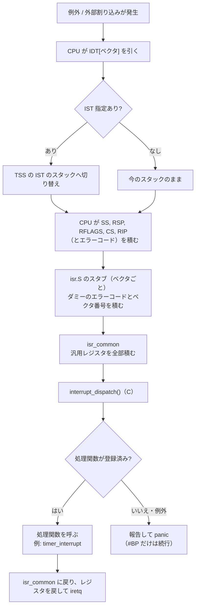
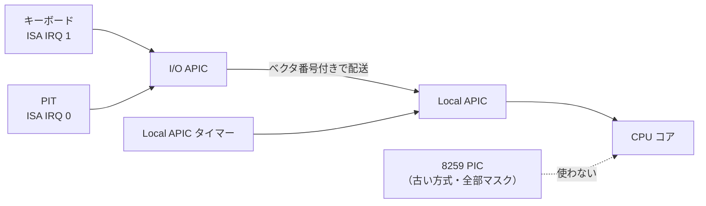
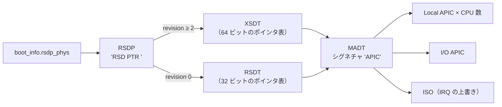
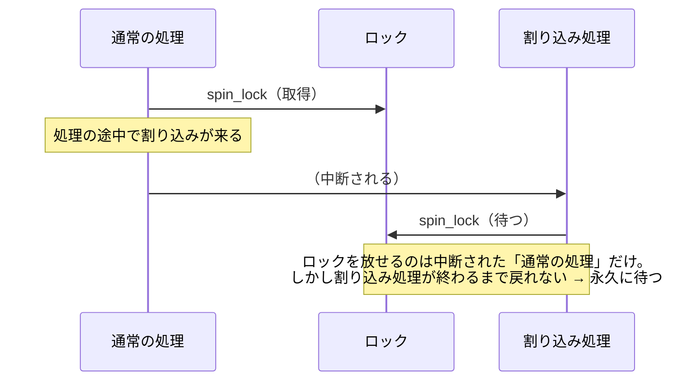

# M1 解説書：CPU の基礎（C 版 Kui）

M1 では、**CPU に「何か起きたら、ここへ来て」と教える仕組み**を作りました。
具体的には、例外（0 除算やページフォールトなど）と割り込み（タイマーなど）を受け止められるようになり、
1 秒に 100 回のタイマー割り込みが実際に届くところまで動いています。

M0 のカーネルは「起動して表示して止まる」だけでした。M1 からは、外から届く出来事（割り込み）に反応できます。
これは M3 のマルチタスク（タイマー割り込みで処理を切り替える）や、M6 のキーボード入力の前提になります。

この解説書も M0 と同じく「何をなぜそうしたか」を中心に書いています。

---

## 1. 何ができるようになったか

`scripts/dev make run` で起動すると、M0 の表示（boot_info）に続いて次のように出力されます。

```text
Kui 0.0.1 (Tangmen C kernel)
bootloader: Limine 11.2.1
...（M0 と同じ boot_info の表示）...
gdt: loaded
idt: loaded (256 vectors)
acpi: MADT: 1 cpus, 1 ioapics, 5 overrides
lapic: id 0, base 0xfee00000
ioapic: id 0, base 0xfec00000, gsi 0-23
timer: lapic 63210 counts/ms, 100 Hz
kui: interrupts enabled
kui: timer ok (10 ticks)
kui: init complete
```

各行の意味です。

| 行 | 意味 |
| --- | --- |
| `gdt: loaded` | カーネル自前の GDT と TSS を読み込んだ（3 章） |
| `idt: loaded (256 vectors)` | 256 個すべての割り込みベクタの入口を登録した（4 章） |
| `acpi: MADT: ...` | ACPI の表から、割り込みコントローラの場所と数を読んだ（6 章） |
| `lapic: ...` / `ioapic: ...` | Local APIC と I/O APIC を初期化した（6 章） |
| `timer: lapic 63210 counts/ms, 100 Hz` | タイマーを較正し、1 秒に 100 回の割り込みを設定した（8 章） |
| `kui: timer ok (10 ticks)` | 実際にタイマー割り込みが 10 回届いたことを確認した |

`init complete` の後、M0 では CPU を完全に止めていましたが、M1 では**割り込みを受けながら休み続けます**（`hlt` で待ち、割り込みが来るたびに起きる）。

### 例外が起きたときの表示

コマンドラインで `selftest=pagefault` を渡すと、割り当てのないアドレス `0xdead0000` をわざと読みます。
すると次のように報告して止まります。

```text
EXCEPTION: #PF Page Fault (vector 14, error 0x0)
  RIP=0xffffffff80003541 RSP=0xffff80000bfc0f20 RFLAGS=0x0000000000010246
  RAX=0x00000000dead0000 RBX=0xffff80000bfc0f50 RCX=0x0000000000000000
  ...（全レジスタ）...
  CS=0x8 SS=0x10 CR3=0x000000000bfb0000
  CR2=0x00000000dead0000
  stack trace:
    #0 0xffffffff80003541 selftest_pagefault+0x9
    #1 0xffffffff800034ed cpu_selftest+0x75
    #2 0xffffffff80004dc8 kmain+0x8b0
    #3 0xffffffff80003608 _start+0x30
PANIC: unhandled exception #PF
  called from 0xffffffff80001db3
  stack trace:
    ...（panic を呼んだ場所からのスタックトレース）...
```

- **何の例外か**（`#PF Page Fault`）と、**どこで起きたか**（`RIP` と、関数名付きのスタックトレース）が分かります。
- ページフォールトでは、**アクセスしようとしたアドレス**が `CR2` に出ます。
- M0 までは、例外が起きると CPU がリセットされて何も分かりませんでした（5 章のトリプルフォールト）。
  M1 からは、不具合の場所をこの表示から追えるようになります。

---

## 2. 割り込みと例外の全体像

「割り込み」は、CPU が今やっている処理を中断して、別の処理（割り込み処理）へ跳ぶ仕組みです。
x86_64 では、原因によって大きく 2 種類に分けられます。

| 種類 | 原因 | 例 |
| --- | --- | --- |
| 例外 | CPU 自身が命令の実行中に問題を見つけた | 0 除算（#DE）、ページフォールト（#PF）、未定義命令（#UD） |
| 外部割り込み | CPU の外（デバイス）から合図が来た | タイマー、キーボード、ディスク |

どちらにも 0〜255 の**ベクタ番号**が付いていて、CPU はその番号で「どこへ跳ぶか」を決めます。
Kui のベクタの割り当ては次のとおりです（`kui/arch/x86_64/interrupt.h`）。

| ベクタ | 用途 |
| --- | --- |
| 0x00〜0x1f | CPU の例外（番号は CPU が決めている。#DE=0、#PF=14 など） |
| 0x20〜0x2f | ISA の IRQ 0〜15（I/O APIC 経由。キーボードは M6 で使う） |
| 0x40 | Local APIC タイマー |
| 0x81 | カーネル内テスト用（ソフトウェア割り込みで呼ぶ） |
| 0xff | Local APIC のスプリアス割り込み（何もしない） |

割り込みが起きてから C の処理関数に届くまでの流れです。



以下、この流れに沿って説明します。

---

## 3. セグメントと GDT / TSS（`src/arch/x86_64/gdt.c`）

### 64 ビットモードで GDT がまだ必要な理由

GDT（Global Descriptor Table）は、もともと「セグメント」というメモリの区切りを定義する表でした。
64 ビットモードでは、セグメントの基底アドレスと上限はほぼ無視されます（メモリの保護はページングで行う）。
それでも GDT は次の 2 つのために残っています。

1. **コードセグメントの性質**：「64 ビットのコードか」（L ビット）と「特権レベル」（ring 0 = カーネル、ring 3 = ユーザー）
2. **TSS の場所**：TSS（後述）は GDT の中の記述子で指す決まりになっている

Limine も GDT を用意してくれますが、ブートローダー用のメモリにあり、後で再利用（M2）する予定です。
そこでカーネル自身の GDT を作って読み込み直しています。

### GDT の並び

```text
0x00 null（必須の空エントリ）
0x08 カーネル コード（64 ビット、ring 0）
0x10 カーネル データ（ring 0）
0x18 ユーザー データ（ring 3）  セレクタ値 0x1b
0x20 ユーザー コード（64 ビット、ring 3）  セレクタ値 0x23
0x28 TSS（16 バイト = 2 エントリ分）
```

「ユーザーはデータが先、コードが後」という並びは不自然に見えますが、M4 で使う `syscall` / `sysret` 命令の都合です。
`sysret` は「基準のセレクタ + 8 をデータ、+ 16 をコード」として扱うため、この順に並べる必要があります。
今のうちに合わせておくと、M4 で GDT を並べ替えずに済みます。

セレクタ値の下位 2 ビットは「要求する特権レベル」です。ユーザー用は 3 なので、`0x18 | 3 = 0x1b` になります。

### セグメントレジスタの読み直し

GDT を読み込む命令（`lgdt`）は、表の場所を CPU に教えるだけです。
セグメントレジスタ（CS, DS, SS など）は記述子の内容を内部に覚えているので、**新しいセレクタを入れ直すまで古いまま**です。

- DS, ES, SS は `mov` で入れ直せます。
- **CS は `mov` で変えられません**。「戻り先の CS と RIP」をスタックに積み、`lretq`（far return）で「戻る」ことで変えています。

### TSS と IST

TSS（Task State Segment）は、名前のとおり昔は「タスクの状態」を保存する場所でした。
64 ビットモードでは役割が変わり、**割り込みのときに切り替えるスタックの場所**を CPU に教えるためだけに使います。

| TSS のフィールド | 用途 | 使い始める時期 |
| --- | --- | --- |
| `rsp0` | ユーザーモード（ring 3）で割り込まれたときに切り替えるカーネルのスタック | M3/M4 |
| `ist1`〜`ist7` | 特定の割り込みで**必ず**切り替える独立したスタック（IST: Interrupt Stack Table） | M1 |

Kui は IST を 3 つ使います（各 16KiB、`.bss` に確保）。

| IST | 例外 | 独立したスタックが必要な理由 |
| --- | --- | --- |
| IST1 | #DF（ダブルフォールト） | 次の節を参照 |
| IST2 | NMI | どんな瞬間にも来うる（スタックの切り替えの途中でも） |
| IST3 | #MC（マシンチェック） | ハードウェアの重大な異常で、今のスタックを信用できない |

### なぜ #DF に独立したスタックが要るのか

カーネルのスタックがあふれた（割り当てのない領域まで伸びた）場面を考えます。

1. スタックへの書き込みでページフォールト（#PF）が起きる
2. CPU は #PF の情報（RIP など）を**同じスタック**に積もうとして、また失敗する
3. 例外の処理中に例外が起きたので、CPU は **#DF（ダブルフォールト）** にする
4. #DF の情報も同じスタックに積めなければ、**トリプルフォールト**になり、CPU がリセットされる

トリプルフォールトでは何も表示されず、いきなり再起動します。原因が分からないので最悪です。
#DF だけ IST1 の別のスタックで受けるようにしておけば、手順 4 で必ず積めるので、報告まで進めます。

自己テスト `selftest=doublefault` は、まさにこの状況を作ります（スタックポインタを割り当てのないアドレスに変えてから `push`）。
実際の出力では `RSP=0xffffc00000000000`（壊したスタックポインタ）が表示され、#DF として報告できています。

---

## 4. IDT と割り込みの入口（`src/arch/x86_64/idt.c`、`isr.S`）

### IDT

IDT（Interrupt Descriptor Table）は「ベクタ番号 → 入口のアドレス」の表です。1 エントリ 16 バイトで、256 個並びます。

| フィールド | Kui での値 |
| --- | --- |
| 入口のアドレス | `isr.S` のスタブ（ベクタごと） |
| セレクタ | カーネルのコード（0x08） |
| IST | #DF=1、NMI=2、#MC=3、それ以外は 0（切り替えない） |
| 種類 | `0x8e` = 64 ビット**割り込みゲート**（DPL 0） |

割り込みゲートは、入るときに**割り込みを禁止（IF=0）**します。
処理中に別の割り込みが入ってくると扱いが難しくなるので、Kui はすべて割り込みゲートにしています（`iretq` で戻ると、元の IF が復元されます）。

### なぜベクタごとにスタブが要るのか

CPU は割り込み時に SS, RSP, RFLAGS, CS, RIP（一部の例外ではエラーコードも）を積みますが、**「何番のベクタか」は積みません**。
1 つの入口を全ベクタで共有すると、どの割り込みが来たのか分からなくなります。

そこで `isr.S` は、ベクタごとに小さな入口（スタブ）を 256 個並べています。各スタブは次のことだけをします。

```asm
    pushq $0          ; エラーコードを積まない例外・割り込みなら、形をそろえるためのダミー
    pushq $<ベクタ>    ; 自分のベクタ番号
    jmp isr_common    ; 共通処理へ
```

スタブは 16 バイト間隔で並べてあるので、ベクタ n の入口は `isr_stubs_start + 16 * n` で計算できます（アドレスの表を別に作らなくてよい）。
`idt_init()` は、スタブが本当に 16 バイト × 256 個並んでいるかを `KASSERT` で確かめています。

### エラーコード

一部の例外では、CPU が原因の詳細を「エラーコード」として積みます。

- 積む例外：#DF(8)、#TS(10)、#NP(11)、#SS(12)、#GP(13)、#PF(14)、#AC(17)、#CP(21)、#VC(29)、#SX(30)
- 積まない例外と外部割り込み：スタブがダミーの 0 を積む

こうしておくと、どのベクタでもスタックの形が同じになり、C 側では 1 つの構造体で扱えます。

例：#PF のエラーコードの下位ビットは「ページが存在したか（P）」「書き込みか（W）」「ユーザーモードか（U）」です。
1 章の例の `error 0x0` は「存在しないページを、カーネルが、読もうとした」という意味です。

### スタックの形（`struct interrupt_frame`）

`isr_common` が汎用レジスタを全部積むと、スタックは次の形になります。
このスタックの先頭アドレスを `struct interrupt_frame *` として C の `interrupt_dispatch()` に渡します。

```text
低いアドレス（RSP）
  ┌──────────────┐ ← interrupt_dispatch(frame) の frame
  │ r15          │ ┐
  │ r14 ... r8   │ │ isr_common が積む（汎用レジスタ 15 個）
  │ rbp rdi rsi  │ │
  │ rdx rcx rbx  │ │
  │ rax          │ ┘
  │ vector       │ ┐ スタブが積む
  │ error_code   │ ┘ （CPU が積んだもの、またはダミーの 0）
  │ rip          │ ┐
  │ cs           │ │
  │ rflags       │ │ CPU が積む
  │ rsp          │ │
  │ ss           │ ┘
  └──────────────┘
高いアドレス
```

積む順番と構造体のフィールドの順番は**逆**になります（スタックは低いアドレスへ伸びるので、最後に積んだ r15 が先頭に来る）。
この対応が 1 つでもずれると全レジスタがずれて見えるので、カーネル内テスト `interrupt_registers_survive_interrupt` で、割り込みの前後でレジスタが保たれることを確かめています。

### スタックの 16 バイト境界

System V ABI（C の関数呼び出しの決まり）では、`call` の直前に RSP が 16 バイト境界にそろっている必要があります。

- CPU は割り込み時に RSP を 16 バイト境界にそろえてから 5 個（40 バイト）積む
- スタブがエラーコードとベクタで 16 バイト
- isr_common が汎用レジスタ 15 個で 120 バイト
- 合計 176 = 16 × 11 バイト

なので、`call interrupt_dispatch` の時点で RSP は 16 バイト境界にそろっています。

### 戻り方（`iretq`）

C の処理から戻ったら、積んだ汎用レジスタを逆順に取り出し、ベクタとエラーコードの 16 バイトを捨ててから `iretq` を実行します。
`iretq` は CPU が積んだ 5 個（RIP, CS, RFLAGS, RSP, SS）を取り出して、割り込まれた場所に戻ります。

もう一つ、入口で `cld` を実行しています。C のコードは「文字列命令の向き（DF フラグ）が 0」を前提にしていますが、
割り込まれた側が DF=1 にしていた可能性があるためです（RFLAGS は `iretq` で元に戻ります）。

### 振り分け（`interrupt_dispatch`）

```c
handler = handlers[vector];         // interrupt_register() で登録された処理関数
if (handler)            → 呼ぶ
else if (vector < 32)   → 例外の既定の処理（報告して panic。#BP だけは報告して続行）
else if (vector == 0xff)→ 何もしない（スプリアス割り込み）
else                    → "interrupt: unexpected vector N" と表示（panic しない）
```

#BP（`int3` 命令）だけ続行するのは、「ここで止まって様子を見たい」という目的で置かれる命令だからです。
`int3` の後の命令から再開しても問題ありません。

---

## 5. 例外の報告とスタックトレース（`src/stacktrace.c`）

### フレームポインタを辿る

M0 から `-fno-omit-frame-pointer` でビルドしているので、各関数の先頭は必ず次のようになっています。

```asm
push %rbp         ; 呼び出し元の rbp を保存
mov  %rsp, %rbp   ; 自分のフレームの基準にする
```

この結果、rbp からたどると次の連結リストになっています。

```text
rbp ─→ [rbp]     = 呼び出し元の rbp ─→ [その rbp]   = さらに呼び出し元の rbp ─→ ... ─→ 0
       [rbp + 8] = 戻りアドレス            [その rbp + 8] = 戻りアドレス
```

`stacktrace_print()` は、このリストを最大 32 段まで辿って戻りアドレスを集めます。
一番外側の `_start` は Limine から rbp = 0 で呼ばれるので、0 に着いたら終わりです。

壊れた rbp を辿って二次災害（ページフォールト）を起こさないよう、次の場合は辿るのをやめます。

- rbp がカーネル空間（上位半分）を指していない、または 8 バイト境界にそろっていない
- 次の rbp が今の rbp より低いアドレス（スタックは低い方へ伸びるので、呼び出し元は必ず高いアドレスにあるはず）

### 戻りアドレスから関数名へ：埋め込みシンボル表

アドレスだけでは読みにくいので、カーネル自身に「関数の開始アドレス・大きさ・名前」の表を埋め込んでいます。
しかし、表の中身（アドレス）はリンクが終わるまで分かりません。そこで **2 段階リンク**をしています（`kernels/c/Makefile`、`tools/gen_symtab.py`）。


この方法が成り立つのは、表が `.rodata`（データ）にだけ置かれ、`.text`（コード）の大きさや並びを変えないからです。
1 回目と 2 回目で関数のアドレスは変わりません。最後の比較は、その前提が本当に守られていることを機械的に確かめるためのものです。

検索（`symbol_lookup`）は、アドレスの昇順に並んだ表の二分探索です。

### 戻りアドレスの「- 1」

戻りアドレスは「call 命令の**次の**命令」を指します。
`panic()` のように戻らない関数の呼び出しは、関数の最後の命令になることがあり、その場合の戻りアドレスは**次の関数の先頭**を指してしまいます。
そこで関数名は `アドレス - 1`（call 命令の中）で引き、表示するずれは元のアドレスを基準にしています。

---

## 6. 割り込みコントローラ

デバイスからの割り込みは、CPU に直接つながっているわけではありません。間に「割り込みコントローラ」があります。



| コントローラ | 役割 | Kui での扱い |
| --- | --- | --- |
| 8259 PIC | 昔の PC の割り込みコントローラ（2 個つないで IRQ 0〜15） | 使わない。ずらしてから全マスク |
| Local APIC | CPU ごとにある。タイマーを内蔵。処理完了（EOI）を受け取る | 有効化して使う |
| I/O APIC | デバイスの割り込みを、どの CPU へどのベクタで届けるか決める | 全入力をマスク。M6 でキーボードを開ける |

### 8259 PIC を止める理由（`src/arch/x86_64/pic.c`）

8259 PIC は、電源投入時の設定のままだとベクタ 0x08〜0x0f に割り込みを出します。
これは CPU の例外（#DF=8 など）と**番号が重なります**。タイマー割り込みが来たのに「ダブルフォールト」に見える、という混乱が起きます。

Limine は PIC の全 IRQ をマスクして渡してくれますが、念のため次の順で処理しています。

1. 初期化コマンド（ICW1〜ICW4）で、ベクタを 0x20〜0x2f へずらす（万一漏れても例外と区別できる）
2. 全 IRQ をマスクする

### Local APIC（`src/arch/x86_64/lapic.c`）

Local APIC のレジスタへのアクセス方法は 2 通りあります。

| モード | アクセス方法 |
| --- | --- |
| xAPIC | 物理アドレス（通常 0xfee00000）の MMIO を読み書き |
| x2APIC | MSR（0x800 + オフセット/16）を `rdmsr` / `wrmsr` で読み書き |

`IA32_APIC_BASE` MSR の bit 10 を見て、ファームウェアがどちらのモードにしているかで決めています。
初期化では、TPR（優先度）を 0 にしてすべての割り込みを受け付け、SVR に「有効化ビット | スプリアスベクタ 0xff」を書きます。

外部割り込みの処理関数は、最後に必ず `lapic_eoi()`（End Of Interrupt）を呼びます。
EOI を送らないと、Local APIC は「まだ処理中」とみなし、同じ優先度以下の割り込みを届けなくなります。

### ACPI の MADT を辿る（`src/acpi.c`、`src/lib/acpi_tables.c`）

I/O APIC がどこにあり、何個あるかは機種によって違います。この情報はファームウェアが **ACPI のテーブル**として用意しています。



- 各テーブルは、全バイトの合計が 0 になる**チェックサム**で壊れていないか確かめます。
- ACPI のテーブルは、構造体のフィールドが自然な境界にそろっているとは限りません。そのため構造体へキャストせず、**1 バイトずつ組み立てて読みます**。
- ファームウェアのデータは壊れている前提で、長さを必ず確かめてから読みます（範囲外を読まない、長さ 0 のエントリで無限ループしない）。

解析部分（`acpi_parse_madt` など）は `src/lib/` に置いてあり、ハードウェアに依存しません。
ホスト単体テスト（`tests/host/test_acpi.c`）で、作り物の MADT を使って、壊れた入力も含めて検証しています。

### ISO（Interrupt Source Override）

ISA の IRQ 番号と、I/O APIC の入力番号（GSI）は、普通は同じです。ただし例外があり、その「上書き」が ISO です。

QEMU の例では 5 個の ISO があり、代表的なのは「ISA IRQ 0（PIT）→ GSI 2」です。
ISO には極性（active high / low）とトリガモード（edge / level）の指定も入っているので、
`ioapic_route_isa_irq()` はこれを I/O APIC の設定に反映します。指定がなければ ISA の既定（active high、edge）にします。

### I/O APIC（`src/arch/x86_64/ioapic.c`）

I/O APIC のレジスタは、2 つの窓口だけで読み書きします。

1. `IOREGSEL`（オフセット 0x00）にレジスタ番号を書く
2. `IOWIN`（オフセット 0x10）でそのレジスタを読み書きする

この 2 手順の間に割り込まれて、割り込み処理が別のレジスタ番号を書くと壊れます。そこで**スピンロック（irqsave）で守って**います。

M1 では全入力をマスクするだけで、どのデバイスの割り込みも開けていません。キーボード（ISA IRQ 1）は M6 で開けます。

---

## 7. MMIO と HHDM の問題（`src/mmio.c`）

Local APIC（0xfee00000）と I/O APIC（0xfec00000）のレジスタは、物理アドレス上にあります（MMIO：メモリのように読み書きするデバイスのレジスタ）。
ところが M0 で見たとおり、Limine の HHDM（物理メモリの直接マップ）は**メモリマップに載った領域しか割り当てません**。
APIC のアドレスはメモリマップに載っていないので、そのままでは読み書きできず、ページフォールトになります。

本格的な解決は M2（自前のページテーブル）ですが、M1 の時点でもタイマーを動かしたいので、つなぎの仕組みとして `mmio_map()` を作りました。

1. 今の CR3 から、Limine が作ったページテーブルを辿る（ページテーブル自体は HHDM 上にあるので読み書きできる）
2. `phys + hhdm_offset` の仮想アドレスに、4KiB ページを 1 枚書き足す
3. 属性は「キャッシュ無効（PCD | PWT）・書き込み可・実行不可（NX）」
4. 途中の段のページテーブルが足りなければ、カーネルの `.bss` に用意した予備ページ（16 枚）から補う
5. `invlpg` で、そのアドレスの TLB（ページテーブルのキャッシュ）を捨てる

**キャッシュ無効**が重要です。デバイスのレジスタは、読むたびに値が変わったり、書いた瞬間に動作したりします。
CPU のキャッシュが間に入ると、古い値を読んだり、書き込みが遅れたりします。

途中の段が 2MiB や 1GiB の「大きいページ」で終わっていた場合は、512 枚の小さいページに分割してから書き足します（割り当て先と属性は引き継ぐので見え方は変わりません）。

---

## 8. タイマーと較正（`src/timer.c`、`src/arch/x86_64/pit.c`）

### Local APIC タイマーの問題点

Local APIC のタイマーは、指定した数から 0 まで数え下げて割り込みを起こし、周期モードなら自動で繰り返します。
ただし、**数える速さが機種ごとに違い、CPU からは分かりません**。「1 秒に 100 回」にするための初期値が決められません。

### PIT で物差しを作る

PIT（8254）は、昔から PC にあるタイマーで、**1.193182MHz の固定周波数**で数えます。周波数が分かっているので「本当の時間」の物差しになります。

較正の手順です。

1. Local APIC タイマーを 16 分周・ワンショットで、最大値（0xffffffff）から数え下げさせる
2. PIT で 10ms 待つ
3. その間に Local APIC タイマーが減った数 ÷ 10 = **1ms あたりのカウント数**

1 章の例では 63210 counts/ms でした。100Hz（10ms ごと）にするには、初期値を 63210 × 1000 ÷ 100 = 632100 にします。

PIT のチャンネル 2（本来は PC スピーカー用）を使っているのは、ゲート（ポート 0x61 の bit 0）で数え始めを制御でき、
数え終わったかどうかをポート 0x61 の bit 5 で読めるからです。**割り込みを使わずに**待てるので、割り込みの準備が終わる前でも使えます。

### タイマー割り込みの処理

```c
static void timer_interrupt(struct interrupt_frame *frame)
{
	__atomic_fetch_add(&ticks, 1, __ATOMIC_RELAXED);
	lapic_eoi();
}
```

今は回数（ticks）を数えるだけです。M3 では、ここで「次に実行する処理」への切り替え（プリエンプション）を行います。

`timer_wait_ticks()` は、`hlt` で割り込みを待ちながら ticks が目標に達するのを待ちます。
割り込みが禁止されたまま呼ぶと `hlt` から永久に戻らないので、その場合は panic します。

---

## 9. スピンロックと割り込み（`src/spinlock.c`）

### なぜ M1 でロックが必要になったのか

M0 には「同時に動く処理」がありませんでした。M1 からは**割り込み処理**が、通常の処理の途中に割り込んできます。
両方が同じデータ（たとえば printk の出力先）を使うと、壊れます。

要件定義では「シングルコアで動かすが、ロックは最初から入れておく」と決めています。M1 がその最初の場面です。

### 取り方と放し方

```text
取得: locked を不可分（atomic）に 1 と交換する
      元の値が 0 → 取得成功
      元の値が 1 → 誰かが使用中。空くまで pause しながら読み続ける
解放: locked に 0 を書く
```

取得には ACQUIRE、解放には RELEASE のメモリ順序を付けています。
これで「ロックの中で行った読み書きが、ロックの外にはみ出して見える」ことを、コンパイラにも CPU にも防がせます。

### `spin_lock_irqsave` が必要な理由

割り込み処理の中でも取るロックを、普通の `spin_lock` で取るとどうなるかを考えます。



これが**デッドロック**です。割り込みを禁止してからロックを取れば、ロックを持っている間は割り込まれないので起きません。

```c
uint64_t flags = spin_lock_irqsave(&lock);   // 割り込み禁止 → 取得（禁止前の状態を返す）
...
spin_unlock_irqrestore(&lock, flags);        // 解放 → 元の状態に戻す
```

`restore` は「元が許可なら許可に戻す、元が禁止なら禁止のまま」です。
割り込みが禁止されている場所で呼ばれても、勝手に許可してしまうことがありません（入れ子にできる）。

順番にも意味があります。**先に割り込みを禁止してから**取得します。逆だと、取得した直後・禁止する直前に割り込まれる隙ができます。

### デッドロックの検出

今は CPU が 1 つしかないので、次の状況は**必ず**デッドロックです。

> 割り込みが禁止された状態で、使用中のロックを待とうとした

ロックを放せるのは同じ CPU 上の「割り込まれた側の処理」だけで、割り込みが禁止されていればそれは二度と動きません。
そこで `acquire()` は、この状況になった瞬間に待たずに panic します。

```text
PANIC: spinlock: deadlock: 'selftest' is already held (acquired at 0x..., requested at 0x...)
```

マルチ CPU に対応するとき（M6 以降）は、「他の CPU が持っていて、すぐ放す」場合と区別するため、持ち主の CPU 番号を記録して比べる方式に変える必要があります。

---

## 10. printk と panic の排他（`src/printk.c`、`src/panic.c`）

### printk のロック

通常の処理の printk の途中で割り込まれ、割り込み処理も printk すると、2 つの行が文字単位で混ざります。
そこで **1 回の printk 全体**を `spin_lock_irqsave` で囲んでいます。

### ロックを使わない 2 つの経路

ロックを入れると、新しい問題が出ます。**printk のロックを持ったまま panic したら？**
panic も printk で表示するので、ロックを待って永久に固まります（しかも 9 章の検出で、また panic）。

| 経路 | 使う場面 |
| --- | --- |
| panic モード | `panic()` が最初に `printk_set_panic_mode()` を呼ぶ。以後の printk はロックを取らない（元には戻らない） |
| `printk_emergency()` | スピンロックの「長く待っている」警告など、printk のロック待ちの最中にも出したい表示 |

panic モードではロックを無視するので出力が混ざる可能性はありますが、panic 中は割り込みも禁止されているので、実際には混ざりません。
「止まる前に情報を出し切る」ことを優先しています。

### panic の表示

M1 から、panic でもスタックトレースを表示します。

```text
PANIC: <メッセージ>
  called from 0x<panic を呼んだ場所>
  stack trace:
    #0 ... panic+0x...
    #1 ...
```

例外で panic した場合は、例外の報告（例外が起きた場所からのトレース）と、panic のトレース（panic を呼んだ場所からのトレース）の 2 つが出ます。
後者は `interrupt_dispatch` → `isr_common` → 割り込まれた関数、と辿ります。

---

## 11. テスト

M1 では、テストを 3 層すべてに追加しました。

| 層 | 追加したもの | 確かめていること |
| --- | --- | --- |
| ホスト単体 | `test_acpi.c`（10 件） | MADT の解析。正常系、短すぎる長さ、長さ 0 のエントリ、上限超過、64 ビットのアドレス上書き |
| カーネル内（ktest） | `test_interrupt.c`（9 件） | ソフトウェア割り込み（`int $0x81`）が登録した関数に届く、#BP から戻る、割り込みの前後でレジスタが保たれる、シンボル表、GDT / TSS / IDT の読み戻し |
| カーネル内（ktest） | `test_apic_timer.c`（5 件） | MADT が取れている、Local APIC の ID が MADT にある、`mmio_map` を 2 回呼んでも同じアドレス、ticks が増える、tick の間隔がおおむね正しい |
| カーネル内（ktest） | `test_spinlock.c`（7 件） | 取得と解放、trylock、irqsave で割り込みが禁止され restore で元に戻る、入れ子 |
| 結合 | `m1_boot`、`m1_timer` | 初期化の行が順に出て、タイマーが動き、`init complete` まで進む |
| 結合 | `m1_exception_divzero` / `pagefault` / `doublefault` / `ud` | 例外が報告され、スタックトレースに `kmain` が含まれ、panic する。#PF では `CR2=0x00000000dead0000` |
| 結合 | `m1_breakpoint` | #BP は報告だけして続行し、`init complete` まで進む |
| 結合 | `m1_selftest_spinlock` | ロックの二重取得をデッドロックとして検出する |

例外の自己テスト（`src/arch/x86_64/selftest.c`）は、例外を起こす命令を**アセンブリで直接**書いています。
C で `1 / 0` と書くと、debug ビルドでは UBSan が先に「未定義動作」として止めてしまい、CPU の例外まで届かないからです。

tick の間隔のテストは、KVM なし（TCG）の CI でも落ちないよう、許容幅を 0.5〜2 倍と緩くしています。
TCG では CPU を真似して動かすので、時間の進み方が揺れるためです。

---

## 12. コードの読み方

M1 で追加したコードは、次の順に読むと流れがつかみやすいです。

1. `src/kmain.c` の `init_interrupts()` と `kmain()`：初期化の順番の全体像
2. `include/kui/arch/x86_64/interrupt.h`：ベクタの割り当てと `struct interrupt_frame`
3. `src/arch/x86_64/gdt.c`：GDT の並びと TSS / IST
4. `src/arch/x86_64/isr.S`：スタブと `isr_common`（4 章の図と見比べる）
5. `src/arch/x86_64/idt.c`：IDT の設定と `interrupt_dispatch()`
6. `src/stacktrace.c` と `tools/gen_symtab.py`、`Makefile` の `link_with_symtab`
7. `src/lib/acpi_tables.c` → `src/acpi.c`：MADT の解析と探索
8. `src/mmio.c`：ページテーブルを辿って書き足す
9. `src/arch/x86_64/pic.c` → `lapic.c` → `ioapic.c`
10. `src/arch/x86_64/pit.c` → `src/timer.c`：較正とタイマー割り込み
11. `src/spinlock.c` → `src/printk.c` → `src/panic.c`
12. `src/arch/x86_64/selftest.c` と `tests/integration/m1_*.toml`：どう壊して、何を確かめているか

---

## 13. 設計判断の一覧

| 判断 | 理由 | 検討した代替案 |
| --- | --- | --- |
| GDT を `syscall`/`sysret` の並びにしておく | M4 で GDT を並べ替えずに済む | 素直な順（コード → データ）にして M4 で直す |
| #DF / NMI / #MC を IST で受ける | 今のスタックが信用できない場面で、トリプルフォールトを防ぐ | IST なし（スタックあふれで何も分からず再起動する） |
| すべて割り込みゲート（入るとき IF=0） | 処理中に割り込まれる複雑さを避ける | 例外はトラップゲート（処理中も割り込み可） |
| ベクタごとに 16 バイト間隔のスタブ | ベクタ番号を知る手段が他にない。等間隔ならアドレス表が不要 | アドレス表を別に作る |
| エラーコードのない例外にダミーの 0 | スタックの形をそろえ、1 つの構造体で扱う | ベクタごとに構造体を分ける |
| #BP は報告して続行 | 「止めて様子を見る」命令で、続行しても問題ない | 他の例外と同じく panic |
| 2 段階リンクでシンボル表を埋め込む | 外部ツールなしで、panic 時にその場で関数名が分かる | アドレスだけ表示し、ホストで `llvm-addr2line` |
| 8259 PIC はずらしてから全マスク | 例外と番号が重ならないようにする | マスクだけ（Limine に任せる） |
| x2APIC と xAPIC の両対応 | ファームウェアが x2APIC にしている機種でも動く | xAPIC のみ |
| ACPI の解析を `src/lib/` に分離 | 壊れた入力をホスト単体テストで網羅できる | カーネル内で解析し、QEMU の正常な表だけで試す |
| `mmio_map()` で Limine のページテーブルに書き足す | M2 を待たずにタイマーを動かせる | x2APIC 専用にして MMIO を避ける（I/O APIC が使えない） |
| PIT のチャンネル 2 で較正 | 周波数が既知で、割り込みなしで待てる | HPET、ACPI PM タイマー、TSC |
| 割り込み禁止中の使用中ロック待ちを即 panic | 単一 CPU では必ずデッドロック。固まるより情報を出す | 待ち続ける（何も表示されず固まる） |
| printk 全体をロック、panic 中はロックなし | 行が混ざらないこと／panic 時に必ず表示できること | ロックなし（行が混ざる） |
| 例外の自己テストはアセンブリで書く | C の未定義動作だと UBSan が先に止める | C で書き、UBSan を外したファイルにする |

---

## 14. 確認問題（自習用）

<details>
<summary>Q1. 64 ビットモードではセグメントの基底と上限がほぼ無視されるのに、GDT を作る必要があるのはなぜですか？</summary>

コードセグメントの性質（64 ビットコードか、特権レベル）を決めるためと、TSS の場所を CPU に教えるためです。
TSS は GDT の中の記述子で指す決まりになっています。
</details>

<details>
<summary>Q2. ダブルフォールトを IST で受けないと、スタックあふれのときに何が起きますか？</summary>

#PF の情報を壊れたスタックに積めずに #DF になり、#DF の情報も同じスタックに積めないので、トリプルフォールトで CPU がリセットされます。
何も表示されずに再起動するので、原因が分かりません。
</details>

<details>
<summary>Q3. isr.S で、ベクタごとに別々の入口（スタブ）を用意しているのはなぜですか？</summary>

CPU は割り込み時にベクタ番号をスタックに積まないからです。入口が共通だと、どの割り込みが来たのか分かりません。
各スタブが自分のベクタ番号を積んでから共通処理へ跳びます。
</details>

<details>
<summary>Q4. 外部割り込みの処理関数が lapic_eoi() を呼び忘れると、どうなりますか？</summary>

Local APIC が「まだ処理中」とみなし、同じ優先度以下の割り込みを届けなくなります。
タイマーなら、最初の 1 回だけ届いて、以後止まったように見えます。
</details>

<details>
<summary>Q5. Local APIC のレジスタを読むために mmio_map() が必要だったのはなぜですか？</summary>

Limine の HHDM はメモリマップに載った領域しか割り当てず、APIC のアドレス（0xfee00000）は載っていないからです。
そのまま読むとページフォールトになります。また、デバイスのレジスタはキャッシュ無効で割り当てる必要があります。
</details>

<details>
<summary>Q6. タイマーの較正で、PIT で 10ms 待つ間に Local APIC タイマーが 632100 減りました。100Hz にするための初期値はいくつですか？</summary>

1ms あたり 63210 カウントなので、10ms（100Hz の間隔）では 632100 です。
計算式は 63210 × 1000 ÷ 100 = 632100 です。
</details>

<details>
<summary>Q7. 割り込み処理でも取るロックを、普通の spin_lock() で取ってはいけないのはなぜですか？</summary>

通常の処理がロックを持ったまま割り込まれ、割り込み処理が同じロックを待つと、ロックを放せる「通常の処理」が二度と動かず、永久に待ちます（デッドロック）。
spin_lock_irqsave() で割り込みを禁止してから取れば、ロックを持っている間は割り込まれません。
</details>

<details>
<summary>Q8. panic() が最初に printk を panic モードに切り替えるのはなぜですか？</summary>

printk のロックを持ったまま panic した場合（例: printk の書式化中に UBSan が反応した）、panic の表示がロックを待って固まってしまうからです。
panic モードではロックを取らずに表示します。
</details>
